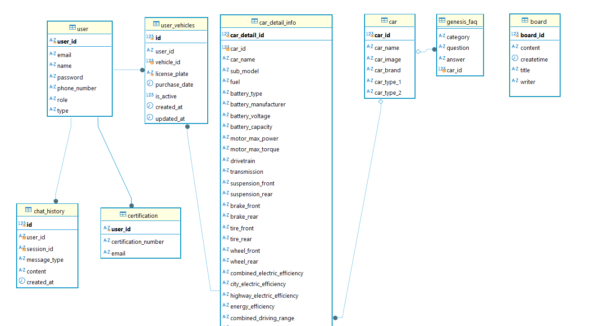

# 데이터베이스 설계 문서

---

## 1. 데이터베이스 개요

챗봇에서 사용자 정보, 차량 정보, FAQ, 채팅 기록 등을 관리하기 위해 설계되었습니다.

---

## 2. 테이블 설계

### 2.1 `user` 테이블

사용자 기본 정보를 저장합니다.

| **컬럼명** | **데이터 타입** | **설명** |
| --- | --- | --- |
| `user_id` | VARCHAR(255) | 사용자 고유 ID |
| `email` | VARCHAR(255) | 사용자 이메일 |
| `name` | VARCHAR(255) | 사용자 이름 |
| `password` | VARCHAR(255) | 사용자 비밀번호 |
| `phone_number` | VARCHAR(255) | 사용자 전화번호 |
| `role` | VARCHAR(255) | 사용자 역할 (관리자/일반사용자) |
| `type` | VARCHAR(255) | 사용자 유형 (개인/기업) |

---

### 2.2 `user_vehicles` 테이블

사용자가 소유한 차량 정보를 저장합니다.

| **컬럼명** | **데이터 타입** | **설명** |
| --- | --- | --- |
| `id` | BIGINT (PK) | 고유 ID |
| `user_id` | VARCHAR(255) | 사용자 ID (`user` 참조) |
| `vehicle_id` | INT | 차량 ID |
| `license_plate` | VARCHAR(20) | 차량 번호판 |
| `purchase_date` | DATE | 구매 날짜 |
| `is_active` | TINYINT | 차량 활성화 여부 |
| `created_at` | TIMESTAMP | 생성 날짜 |
| `updated_at` | TIMESTAMP | 수정 날짜 |

---

### 2.3 `car` 테이블

원본 차량의 기본 정보를 담당합니다.

| **컬럼명** | **데이터 타입** | **설명** |
| --- | --- | --- |
| `car_id` | INT (PK) | 차량 고유 ID |
| `car_name` | VARCHAR(100) | 차량 이름 |
| `car_image` | VARCHAR(100) | 차량 이미지 |
| `car_brand` | VARCHAR(100) | 차량 브랜드 |
| `car_type_1` | VARCHAR(100) | 1차 분류 (예: 세단) |
| `car_type_2` | VARCHAR(100) | 2차 분류 |

---

### 2.4 `car_detail_info` 테이블

차량 세부 정보를 저장합니다.

| **컬럼명** | **데이터 타입** | **설명** |
| --- | --- | --- |
| `car_detail_id` | INT (PK) | 고유 ID |
| `car_id` | INT (FK) | 차량 ID (`car` 참조) |
| `car_name` | VARCHAR(100) | 차량 이름 |
| `sub_model` | VARCHAR(100) | 세부 모델명 |
| `fuel` | VARCHAR(50) | 연료 유형 |
| `battery_type` | VARCHAR(50) | 배터리 종류 |
| `battery_manufacturer` | VARCHAR(100) | 배터리 제조사 |
| `battery_voltage` | VARCHAR(100) | 배터리 전압 |
| `battery_capacity` | TEXT | 배터리 용량 |
| `motor_max_power` | TEXT | 모터 최대 출력 |
| `motor_max_torque` | TEXT | 모터 최대 토크 |
| `drivetrain` | TEXT | 구동 방식 |
| `transmission` | TEXT | 변속기 |
| `suspension_front` | TEXT | 전륜 서스펜션 |
| `suspension_rear` | TEXT | 후륜 서스펜션 |
| `brake_front` | TEXT | 전륜 브레이크 |
| `brake_rear` | TEXT | 후륜 브레이크 |
| `tire_front` | TEXT | 전륜 타이어 |
| `tire_rear` | TEXT | 후륜 타이어 |
| `wheel_front` | TEXT | 전륜 휠 |
| `wheel_rear` | TEXT | 후륜 휠 |
| `combined_electric_efficiency` | TEXT | 복합 전비 |
| `city_electric_efficiency` | TEXT | 도심 전비 |
| `highway_electric_efficiency` | TEXT | 고속도로 전비 |
| `energy_efficiency` | TEXT | 에너지 효율 |
| `combined_driving_range` | TEXT | 복합 주행 거리 |
| `city_driving_range` | TEXT | 도심 주행 거리 |
| `highway_driving_range` | TEXT | 고속도로 주행 거리 |
| `length` | TEXT | 차량 길이 |
| `width` | TEXT | 차량 폭 |
| `height` | TEXT | 차량 높이 |
| `wheelbase` | TEXT | 휠베이스 |
| `track_width_front` | TEXT | 전륜 트랙 너비 |
| `track_width_rear` | TEXT | 후륜 트랙 너비 |
| `seating_capacity` | BIGINT | 좌석 수 |
| `curb_weight` | TEXT | 공차 중량 |
| `headlamp` | TEXT | 헤드램프 |
| `headlamp_features` | TEXT | 헤드램프 기능 |
| `daytime_running_lights` | TEXT | 주간 주행등 |
| `rear_lamp` | TEXT | 후방 램프 |
| `outside_mirror` | TEXT | 외부 미러 |
| `wiper` | TEXT | 와이퍼 |
| `uv_protection_glass` | TEXT | UV 차단 유리 |
| `soundproof_glass` | TEXT | 방음 유리 |
| `instrument_cluster` | TEXT | 계기판 |
| `steering_wheel` | TEXT | 스티어링 휠 |
| `gear_knob` | TEXT | 기어 노브 |
| `room_mirror` | TEXT | 실내 미러 |
| `ambient_light` | TEXT | 앰비언트 라이트 |
| `airbags` | TEXT | 에어백 |
| `driving_safety` | TEXT | 주행 안전 시스템 |
| `cruise_control` | TEXT | 크루즈 컨트롤 |
| `parking_brake` | TEXT | 주차 브레이크 |
| `engine_start` | TEXT | 엔진 스타트 기능 |
| `trunk` | TEXT | 트렁크 |
| `power_outlet` | TEXT | 전원 아웃렛 |
| `parking_assist` | TEXT | 주차 보조 기능 |
| `seat_layout` | TEXT | 시트 배열 |
| `seat_material` | TEXT | 시트 재질 |
| `driver_seat` | TEXT | 운전석 |
| `passenger_seat` | TEXT | 조수석 |
| `second_row` | TEXT | 2열 시트 |
| `third_row` | TEXT | 3열 시트 |
| `air_conditioner` | TEXT | 에어컨 |
| `rear_air_vent` | TEXT | 후방 에어벤트 |
| `screen_size` | TEXT | 스크린 크기 |
| `multimedia_main_features` | TEXT | 멀티미디어 주요 기능 |
| `multimedia_additional_features` | TEXT | 멀티미디어 추가 기능 |
| `speaker` | DOUBLE | 스피커 |
| `sound_system` | TEXT | 사운드 시스템 |
| `price` | TEXT | 가격 |
| `eco_friendly` | TEXT | 친환경 차량 여부 |
| `engine_type` | TEXT | 엔진 유형 |
| `displacement` | TEXT | 배기량 |
| `max_power` | TEXT | 최대 출력 |
| `max_torque` | TEXT | 최대 토크 |
| `idle_stop_system` | TEXT | 공회전 제한 시스템 |
| `combined_fuel_efficiency` | TEXT | 복합 연비 |
| `city_fuel_efficiency` | TEXT | 도심 연비 |
| `highway_fuel_efficiency` | TEXT | 고속도로 연비 |
| `co2_emission` | TEXT | 이산화탄소 배출량 |
| `fuel_tank` | TEXT | 연료 탱크 용량 |
| `temperature_control_range` | TEXT | 온도 조절 범위 |
| `rear_side_curtain` | TEXT | 후방 측면 커튼 |
| `rear_back_curtain` | TEXT | 후방 뒷면 커튼 |
| `charging_type_slow` | TEXT | 완속 충전 지원 여부 |
| `charging_type_fast` | TEXT | 급속 충전 지원 여부 |
| `zero_to_hundred` | TEXT | 0-100km/h 가속 시간 |
| `pedestrian_safety` | TEXT | 보행자 안전 기능 |
| `main_features` | TEXT | 주요 특징 |
| `additional_features` | TEXT | 추가 특징 |
| `overhang_front` | TEXT | 전방 오버행 길이 |
| `overhang_rear` | TEXT | 후방 오버행 길이 |
| `specs_engine` | TEXT | 엔진 사양 |
| `specs_drivetrain` | TEXT | 구동계 사양 |
| `features_exterior` | TEXT | 외관 특징 |
| `features_interior` | TEXT | 내부 특징 |
| `features_safety` | TEXT | 안전 특징 |
| `features_multimedia` | TEXT | 멀티미디어 특징 |

---

### 2.5 `chat_history` 테이블

사용자와 챗봇 간의 채팅 기록을 저장합니다.

| **컬럼명** | **데이터 타입** | **설명** |
| --- | --- | --- |
| `id` | INT (PK) | 고유 ID |
| `user_id` | VARCHAR(255) | 사용자 ID (`user` 참조) |
| `session_id` | VARCHAR(255) | 세션 ID |
| `message_type` | VARCHAR(255) | 메시지 유형 (입력/응답) |
| `content` | TEXT | 메시지 내용 |
| `created_at` | DATETIME | 생성 시간 (기본값: `NOW()`) |

---

### 2.6 `board` 테이블

게시판 콘텐츠를 저장합니다.

| **컬럼명** | **데이터 타입** | **설명** |
| --- | --- | --- |
| `board_id` | INT (PK) | 게시판 고유 ID |
| `content` | VARCHAR(255) | 게시판 내용 |
| `createtime` | DATETIME | 작성 시간 |
| `title` | VARCHAR(255) | 게시글 제목 |
| `writer` | VARCHAR(255) | 작성자 |

---

### 2.7 `certification` 테이블

사용자 인증 정보를 저장합니다.

| **컬럼명** | **데이터 타입** | **설명** |
| --- | --- | --- |
| `user_id` | VARCHAR(255) | 사용자 ID (`user` 참조) |
| `certification_number` | VARCHAR(255) | 인증 번호 |
| `email` | VARCHAR(255) | 인증 이메일 |

---

## 3. 주요 관계

1. `user`와 `user_vehicles`: 1:N 관계 (한 사용자는 여러 차량 소유 가능).
2. `car`와 `car_detail_info`: 1:N 관계 (한 차량은 여러 세부 정보를 가질 수 있음).
3. `user`와 `chat_history`: 1:N 관계 (한 사용자는 여러 채팅 기록을 가질 수 있음).
4. `car`와 `genesis_faq`: 1:N 관계 (한 차량은 여러 FAQ 항목과 연결 가능).

---